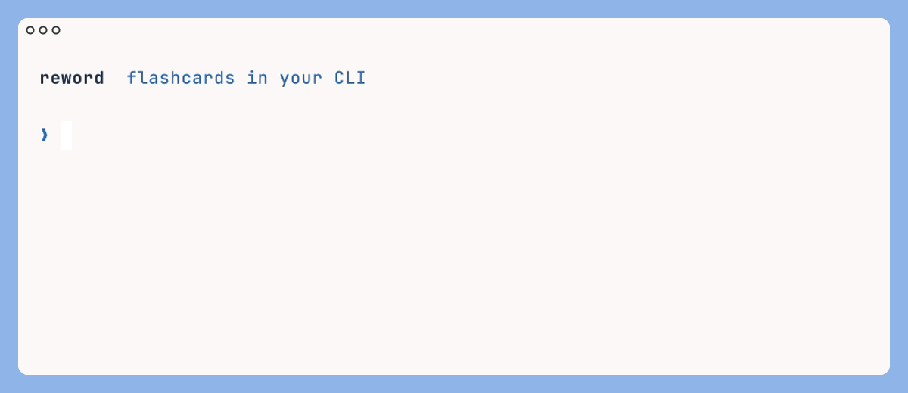

# Reword

[](LICENSE)
[](https://github.com/joshuamotoaki/homebrew-tap)
[](https://github.com/joshuamotoaki/reword/releases)
[](https://github.com/open-spaced-repetition/fsrs4anki)



I wanted a super simple flashcard app I could use to learn languages.
No frills.

This is completely free and runs locally on your machine.
All data is stored in plain text files.
If you want sync across devices, you can sync those files using git or something.

## Install

Homebrew (macOS and Linux):

```bash
brew install joshuamotoaki/tap/reword
```

From a clone, with a [Rust toolchain](https://rustup.rs):

```bash
git clone https://github.com/joshuamotoaki/reword
cd reword
cargo install --path .
```

That builds the binary and puts `reword` on your PATH (`~/.cargo/bin`).
Same command again after you pull to update. `cargo run -- review` works
too, but install is the easy way to just use it.

The first time you run `reword` in a terminal, tab completion for commands
and deck names is enabled for your shell. Open a new tab (or `source`
your `~/.zshrc` / `~/.bashrc`) and Tab after `reword` lists commands.

## Quick start

```bash
reword init                          # creates ~/reword with a README and an example deck
reword add cantonese 食 'to eat'      # creates decks/cantonese.md and appends a card
reword add cantonese 飲 'to drink' -r  # -r: also ask back → front
reword review                        # start a session
```

`reword` on its own shows what is due and what to do next. Cards you keep
failing (Again at least three times) show up there and on `reword stats`
as leeches — the worst five.

## Deck files

A deck is a text file in `~/reword/decks/`, one card per line, in the
Obsidian spaced-repetition convention:

```
# Cantonese, food
食::to eat
飲:::to drink
唔該::excuse me / thank you
```

- `front::back` asks front → back.
- `front:::back` asks both ways. Each direction has its own memory.
- `/` on the answer side separates alternatives for typed mode.
- Anything else is ignored: headings, prose, blank lines. A deck can be an
  ordinary Markdown note with cards in it. Lines starting with `#` and fenced
  code blocks are never cards, so `# 食::to eat` comments a card out.
- Spaces around `::` do not matter. Fronts are compared after trimming and
  Unicode normalization.
- A line splits on the first `:::` if it has one, otherwise the first `::`.
- `#` headings group cards. `reword review cantonese --under food` reviews
  only cards under a heading whose title contains `food` (nested headings
  count: everything under `# Cantonese` / `## Food` matches both).

To have an AI write or edit a deck, paste [FOR_AI.md](FOR_AI.md).

The front is the card's identity within its deck. Edit the files however you
like; every edit has a boring, defined outcome:

| Edit                               | Effect                                                                                                                                                                                                                                            |
| ---------------------------------- | ------------------------------------------------------------------------------------------------------------------------------------------------------------------------------------------------------------------------------------------------- |
| Add a line                         | New card next session.                                                                                                                                                                                                                            |
| Change the back                    | Nothing scheduled changes.                                                                                                                                                                                                                        |
| Delete a line                      | Card leaves the queue. Its history stays; re-adding the same front resumes it.                                                                                                                                                                    |
| Change the front                   | The old history is orphaned. Carry it over with `reword rename DECK OLD NEW`, before or after the edit. If exactly one history is orphaned and exactly one unreviewed card sits among the reviewed ones, `review` asks whether that was a rename. |
| `::` → `:::`                       | The reverse side appears as a new card.                                                                                                                                                                                                           |
| `:::` → `::`                       | The reverse side disappears; its history is kept.                                                                                                                                                                                                 |
| Reorder, add notes, change spacing | No effect.                                                                                                                                                                                                                                        |
| Duplicate a front                  | Warning with both line numbers; the first wins. `add` refuses outright.                                                                                                                                                                           |
| Rename or delete a deck            | Move or delete the `.md` and `.log` together. `reword check` reports a `.log` without its `.md`.                                                                                                                                                  |
| Edit during a session              | Safe. The session read the deck at its start and only appends to the log.                                                                                                                                                                         |

`reword check` lists everything that could be off: duplicates, empty sides,
malformed log lines, orphaned histories, stray logs.

## Reviewing

A session is either **recall** or **typed**, chosen per session, never mixed.
Both feed the same memory of each card. `reword review` asks which unless
you pass `--recall` or `--typed` or set `mode` in the config. Enter
picks recall.

**Recall**: see the front, press space to reveal, press space for Good or
`a` for Again. `h` and `e` (Hard, Easy) exist if you want them. Enter works
like space everywhere.

**Typed**: type the answer and press enter. It is checked against the back
and every `/` alternative, ignoring case and spacing. A miss shows the
expected answer; `o` counts it as a typo. An empty line reveals the answer.

In both modes: `s` skips a card without grading it, `←` (or `u`) undoes the
previous grade or skip as many times as you like, `q` quits. Nothing is ever
lost: every grade is written to the log the moment you press the key, and
undo is written as its own row.

A session takes over the terminal, like `less`: each card is drawn in the
same place, and the keys you can press are always on the bottom row. When
the session ends the terminal comes back as it was, with a one-line
summary.

Sessions are bounded by time by default. `-m 5` gives you five minutes;
the header shows `m:ss` left and ticks every second. `-n 20` stops after
twenty cards (grades or skips) instead, with the clock counting up. Both
flags together end at whichever hits first. When the budget is up you get
a summary and one question, continue or not. What is left simply stays due.

`--endless` is for the days you want to keep going. No time limit, no daily
cap on new cards, and once nothing is due it moves on to the learned cards
closest to being forgotten, most at risk first, with new cards still mixed
in one per five. When that queue empties it starts another round, again
weakest first, until you quit. Scheduling is unaffected: an early review
is just a review with a shorter gap.

## Scheduling

Reword uses FSRS-6, the algorithm Anki ships, with its default parameters
until you have a few hundred reviews. Then `reword optimize` fits the
parameters to your own history and writes `params.toml`.

Each session:

1. Cards you missed earlier in the session come back after five others.
2. Due cards, the ones you are most likely to have forgotten first.
3. New cards, one per five reviews, up to `new_per_day` across all decks.
   `--new N` learns ahead; `--no-new` skips them. New intake pauses by
   itself while the overdue backlog is more than two sessions' worth.

The reverse side of a `:::` card starts only after the forward side has
been recalled once, and the two sides are never in the same session.

Days roll over at 4 am local time, so a late-night session is still today.

## Files

```
~/reword/                 override with --dir or $REWORD_DIR
  README.md               how to add decks by hand; .md and .log
  config.toml             settings; every key optional
  params.toml             written by `reword optimize`
  decks/
    cantonese.md          the cards
    cantonese.log         that deck's review log, append-only
  .gitattributes          "*.log merge=union": git merges logs from two machines
```

Memory state is never stored. It is recomputed from the log every time,
which is instant, so there is nothing to corrupt and a scheduler change
never loses data. To sync, sync the directory. With git, the union merge
driver means two machines can review on the same day without a conflict.

Log rows are tab-separated:

```
2026-09-06T02:11:09Z  食    forward  recall  good   4120
2026-09-06T02:11:31Z  唔該  forward  typed   again  9800   excuse
2026-09-06T02:12:02Z  唔該  forward  typed   good   3000   excuse me   override
2026-09-06T02:12:30Z  食    forward  recall  undo
2026-09-06T02:13:00Z  食    rename   食物
```

Columns: timestamp (UTC), front, direction, mode, grade, milliseconds,
typed answer, and `override` when a typo was waved through. `skip` rows are
postponements and never touch the memory model. An `undo` row cancels the
previous row for that card. A `rename` row moves history to a new front.

## Configuration

`~/reword/config.toml`, all optional:

```toml
desired_retention = 0.90   # recall probability at which a card comes due
session_minutes   = 10
new_per_day       = 10     # across all decks
mode              = "recall"   # or "typed"; stops review asking each time
```

Flags beat the config file. `NO_COLOR` and `--no-color` disable color.
`--no-input` makes every command fail with a hint instead of prompting.

## Commands

```
reword                       status and next step
reword init                  create ~/reword
reword review [DECK...]      start a session (--recall | --typed, -m N | -n N,
                             --endless, --under HEADING, --new N | --no-new)
reword add [DECK] FRONT BACK append a card (-r for both directions)
reword edit [DECK]           open the deck in $EDITOR, then check it
reword decks                 decks with card, learned, due, new counts
reword rename DECK OLD NEW   change a front and carry its history
reword check                 validate decks and logs
reword stats [DECK...]       retention, pace, 14-day forecast
reword optimize              fit FSRS parameters to your history
reword completions [SHELL]   tab-completion snippet (`--install` if you want it now)
```

`--json` on `reword`, `decks`, `check`, `stats`, and `optimize` prints data
for scripts. Exit codes: 0 ok, 1 problem, 2 usage.

## Development

```bash
cargo install --path .    # reword on your PATH; run again after pulling
cargo test
cargo run -- --dir /tmp/reword-play init
```

Rust 2024 edition. Scheduling by the [`fsrs`](https://crates.io/crates/fsrs)
crate from Open Spaced Repetition. Contributor notes are in [DEVELOPMENT.md](DEVELOPMENT.md).

Apache-2.0 License
